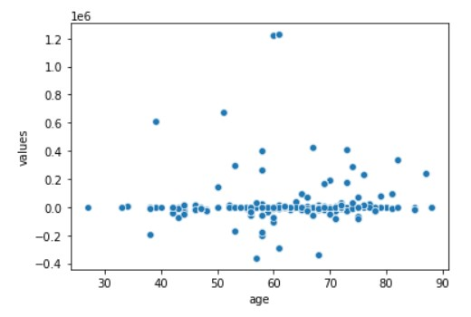
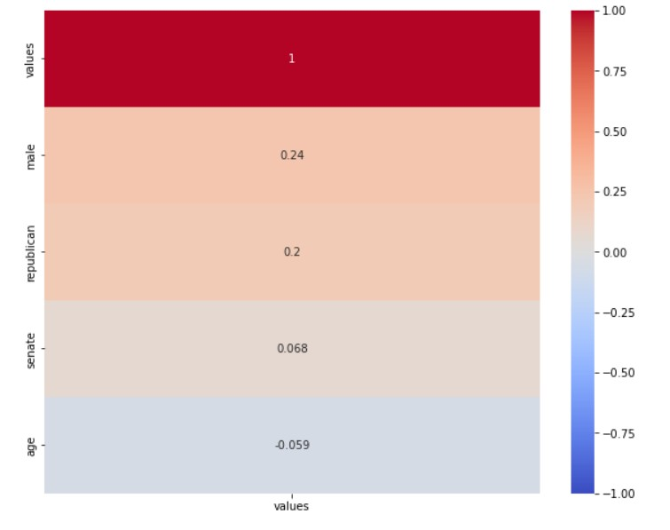

## EDA

Here are some of the findings we had after cleaning and analyzing the data. What we did was create a values column that gave us the total value of a Congress person's portofio at the end of adding up all their trades values. We used this to analyziz the data.

The first thing we will look at is 3 box plots. We compared each to the values of the Congress people. We have one that compares their party, one for gender, and one for chamber (House or Senate). Here is our findings.

Party:

This shows that the Republicans tend to make more in stock trades than the Democrats.

Gender:

Males in Congress seem to make more than females.

Chamber:

Senators seem to make more than the House members.

Next we will show a scatterplot that compares a Congress persons age with the value of their portfolio.

It seems like there is no correlation here. But we can confirm that with a heatmap:

It seems like the best predictor of the returns rate is whether or not the trader was male. Males make more than females in the Congress. However, it isn't too strongly correlated.

Some other finding we found. Only 2 Congressmen (Michael T. McCaul and Greg Gianforte) made over 1 million dollars in their stock portfolio. Just 27.72% of Congress people made a profit in their stock portfolio. We found that 3/18/2020 was the most traded day. This was right around the time the COVID 19 pandemic started in the USA.

